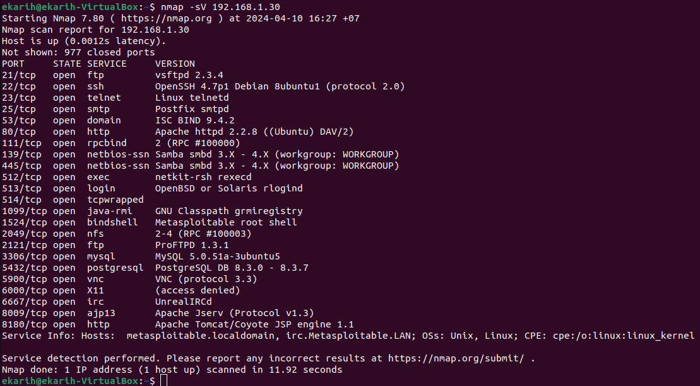
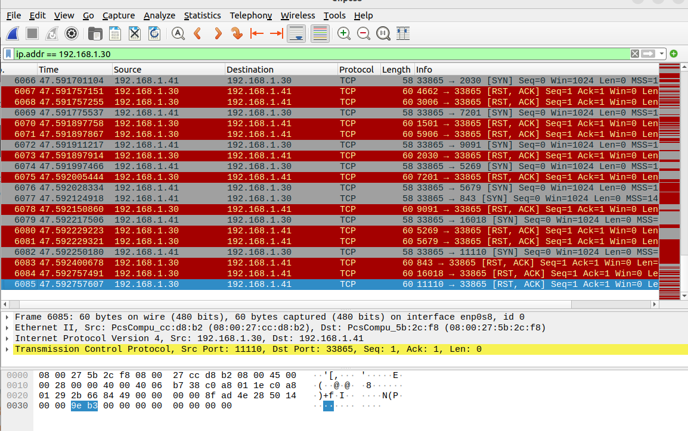
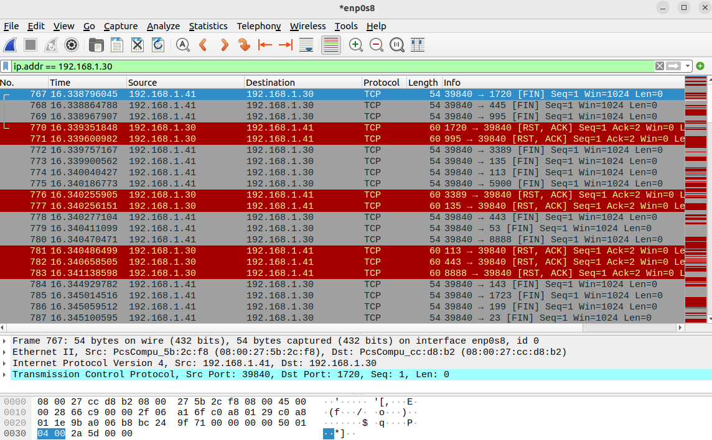
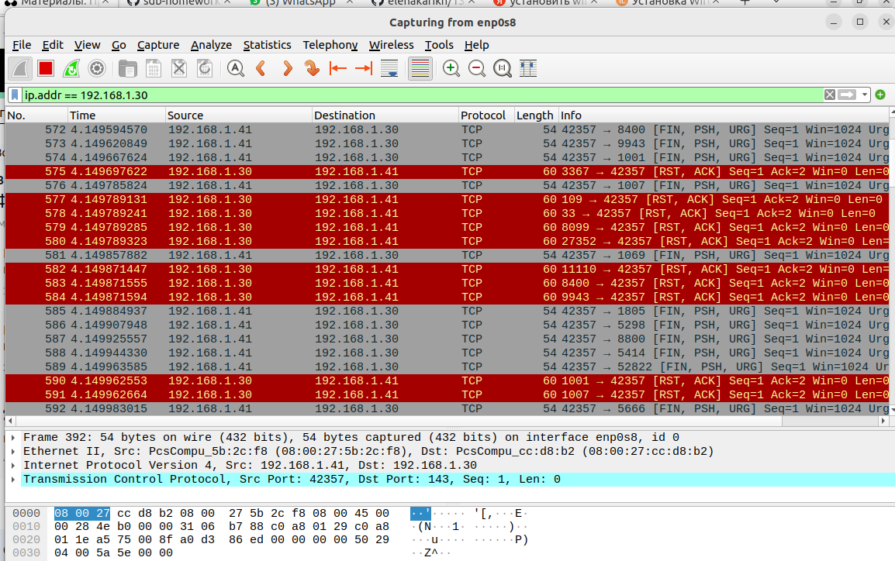
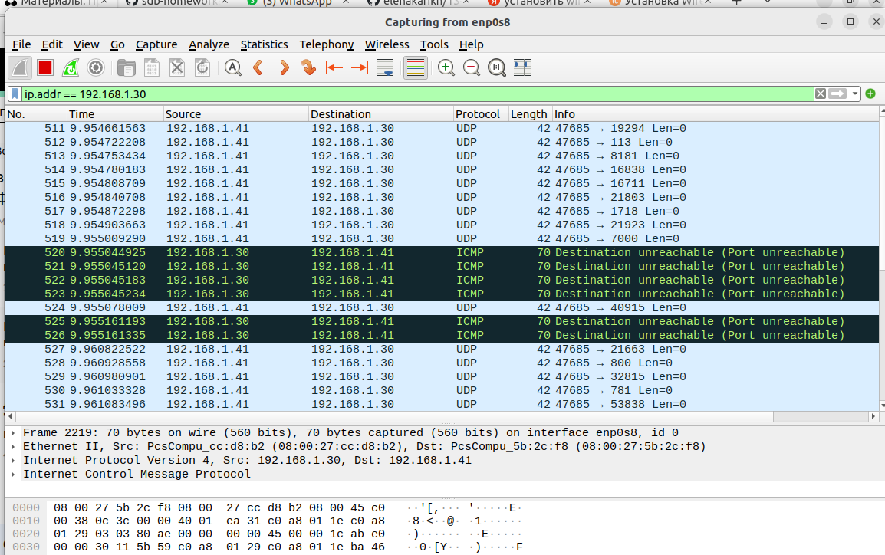

## Домашнее задание к занятию "Уязвимости и атаки на информационные системы" - Карих Елена
---
### Задание 1

Скачайте и установите виртуальную машину Metasploitable: https://sourceforge.net/projects/metasploitable/
Это типовая ОС для экспериментов в области информационной безопасности, с которой следует начать при анализе уязвимостей.
Просканируйте эту виртуальную машину, используя nmap.
Попробуйте найти уязвимости, которым подвержена эта виртуальная машина.
Сами уязвимости можно поискать на сайте https://www.exploit-db.com/.
Для этого нужно в поиске ввести название сетевой службы, обнаруженной на атакуемой машине, и выбрать подходящие по версии уязвимости.
Ответьте на следующие вопросы:
- Какие сетевые службы в ней разрешены?
- Какие уязвимости были вами обнаружены? (список со ссылками: достаточно трёх уязвимостей)

Приведите ответ в свободной форме.

### Решение 1

Установила Metasploitable, настроила сетевое подключение (перевела в UP), просканировала разрешенные службы:



Всего 23 службы разрешено на момент сканирования

Обнаружила уязвимости:
- vsftpd 2.3.4 - https://www.exploit-db.com/exploits/17491
- BIND 9.4.1 < 9.4.2 - https://www.exploit-db.com/exploits/6122 
- MySQL 5.0.x - https://www.exploit-db.com/exploits/30020

---
### Задание 2

Проведите сканирование Metasploitable в режимах SYN, FIN, Xmas, UDP.
Запишите сеансы сканирования в Wireshark.

Ответьте на следующие вопросы:

- Чем отличаются эти режимы сканирования с точки зрения сетевого трафика?
- Как отвечает сервер?

Приведите ответ в свободной форме.

### Решение 2

*TCP SYN-сканирование:*

```
sudo nmap -sS 192.168.1.30
```


TCP SYN - Nmap посылает пакет SYN, желая открыть псевдонастоящее соединение, и ожидает ответ. 
Наличие флагов SYN|ACK в ответе указывает на то, что порт удаленной машины открыт и готов. RST в ответе означает что порт закрыт.

*TCP FIN-сканирование:*

```
sudo nmap -sF 192.168.1.30
```


TCP FIN - Nmap посылает пакет FIN (в TCP заголовок ставится флаг FIN). Если порт закрыт на прибывший FIN-пакет машина ответит пакетом RST. 
Если порт открыт то этот пакет FIN игнорируется.

*Xmas-сканирование:*

```
sudo nmap -sX 192.168.1.30
```


Xmas - Nmap посылает пакеты с флагами  FIN, PSH и URG. Если в результате FIN-сканирования получен список открытых портов, то это не Windows. Если же все эти методы выдали результат, что все порты закрыты, а SYN-сканирование обнаружило открытые порты, то мы скорей всего имеете дело с ОС Windows, Cisco, HP/UX и MVS. Все эти ОС не отправляют RST-пакеты, а отбрасывают непонятные запросы и все..

*UDP-сканирование:*

```
sudo nmap -sU 192.168.1.30
```


UDP - Nmap посылает пакет UDP без данных. Если в ответ получено ICMP-сообщение "Port unreachable" - порт закрыт. 
В противном случае предполагается, что сканируемый порт открыт.

---
